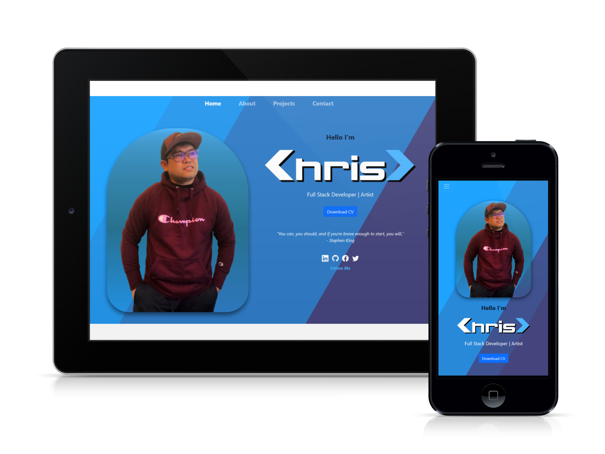

  # React Portfolio
  ## 
  ## This is the first project I creted using ReactJs. It's a React Porfolio that showcase some of my projects and weekly challenges during the bootcamp. This portfolio is still a work in progress...
  ------------------
  ## TECHNOLOGIES USED
  ### HTML
  ### CSS
  ### JavaScript
  ### Node.js
  ### ReactJs
  ### React-Icons
  ### Bootstrap
  ------------------
## SCREENSHOT

  ------------------
  ## INSTALLATION
  ### No installion required
  ------------------
  ## LICENSE  
  ### https://opensource.org/licenses/MIT
  ------------------
  ## DEPLOYMENT  
  ### https://christiandc19.github.io/MyReactPortfolio/
  ### https://github.com/christiandc19/MyReactPortfolio
  ------------------
  ## QUESTIONS  
  ### If you have any questions, you may contact me at:
  ### Github: https://github.com/christiandc19 or,
  ### christiandc19@hotmail.com
